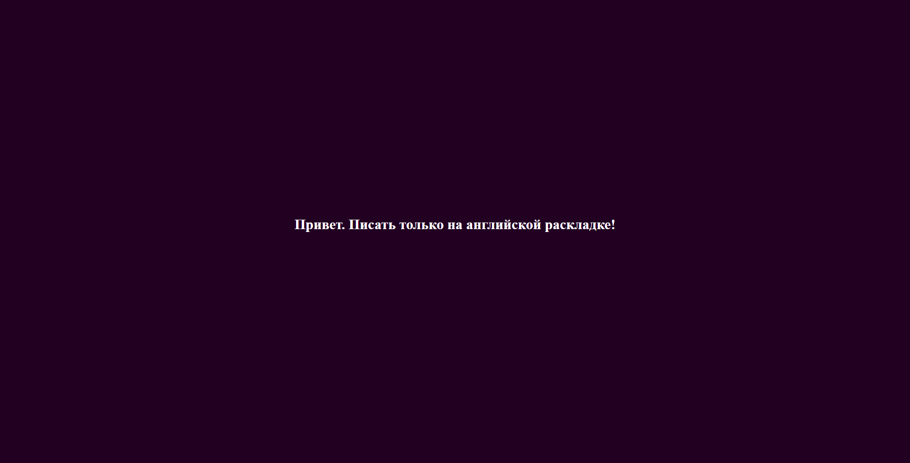

# Игра для тренировки правильности написания самых популярных английскийх слов

Вам нужно за отведенное время и за 3 ошибки набрать как можно больше очков. Каждая правильная буква добавляет одно очко. 

# Для запуска

> Необходимы глобальные зависимости:
>
> 1. [NodeJS](https://nodejs.org/en/)
> 1. [TypeScript](https://www.npmjs.com/package/typescript)
> 1. [Http-Server](https://www.npmjs.com/package/http-server)
> 1. [WebPack](https://www.npmjs.com/package/webpack)
> 1. [WebPack-cli](https://www.npmjs.com/package/webpack-cli)
> 1. [WebPack-dev-Server](https://www.npmjs.com/package/webpack-dev-server)
>

Запуск без необходимости сборки
```bash
> webpack-dev-server
```

Запуск сбоки
```bash
> npm run build
```

Запуск собранной версии
```bash
> http-server -c-1
```

# Скриншоты
>
> 
>
> 
>
> 
>
> 
>
> 
>
> 
>
> 
>